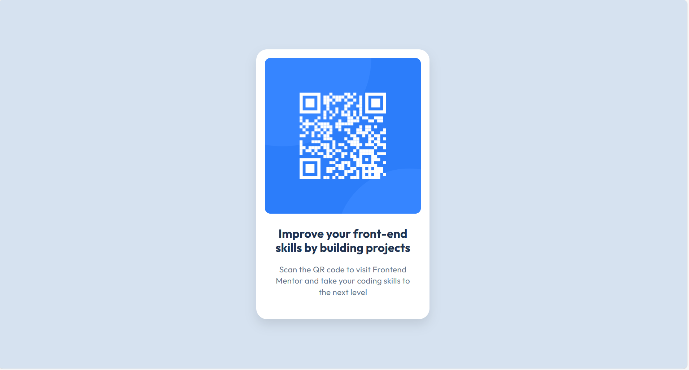
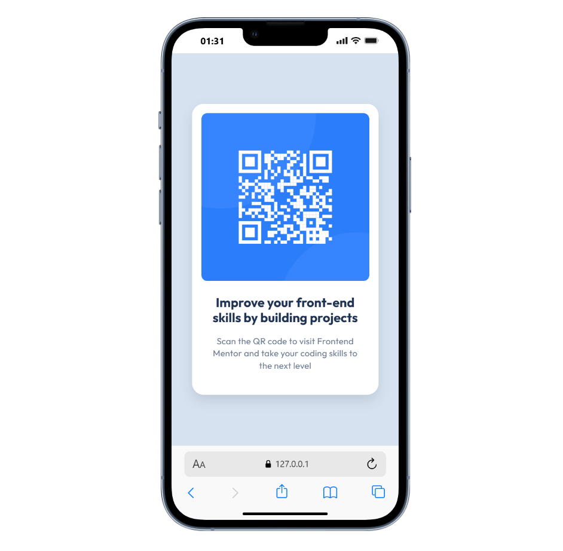

# Frontend Mentor - QR Code Component

This is my solution to the [QR code component challenge](https://www.frontendmentor.io/challenges/qr-code-component-iux_sIO_H) on Frontend Mentor.

## Table of Contents
- [Overview](#overview)
- [Links](#links)
- [Process](#process)
- [Author](#author)


## Overview

### Screenshot
- Web

- Mobile


## Links
- Solution: [View solution](https://github.com/ichane31/QR-code-component)
- Live site: [View live site](https://qr-code-component-three-ashen.vercel.app/)


## Process

### Built with
- Semantic HTML5
- CSS custom properties
- Flexbox
- Mobile-first workflow

### What I learned
I improved my skills in semantic HTML and CSS, especially using Flexbox for centering elements. I also applied a mobile-first approach to ensure the component is responsive.

```html
<div class="qr-code-component">
  
</div>
```

### Continued development
I want to further explore accessibility and CSS animations to enhance user experience in future projects.

### Useful resources
- [MDN Web Docs](https://developer.mozilla.org/en/) - Reference documentation for HTML and CSS.
- [Flexbox Froggy](https://flexboxfroggy.com/) - Interactive game to master Flexbox.


## Author

- ASSOUMA Roukéya
- Frontend Mentor: [@ichane31](https://www.frontendmentor.io/profile/ichane31)


---
Thanks to Frontend Mentor for the inspiring challenges!
